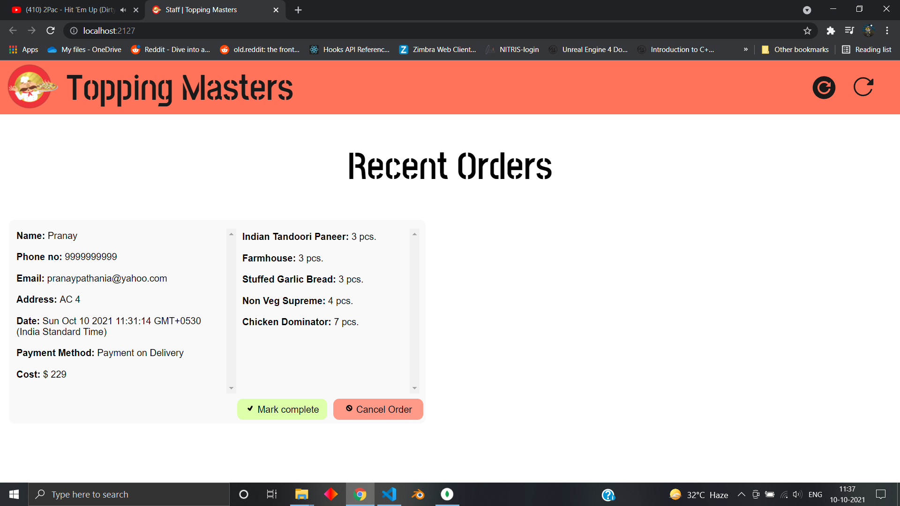
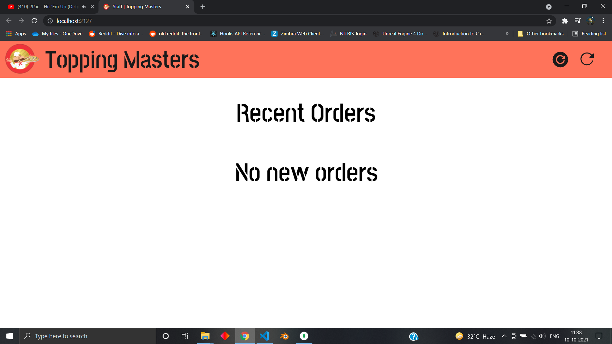
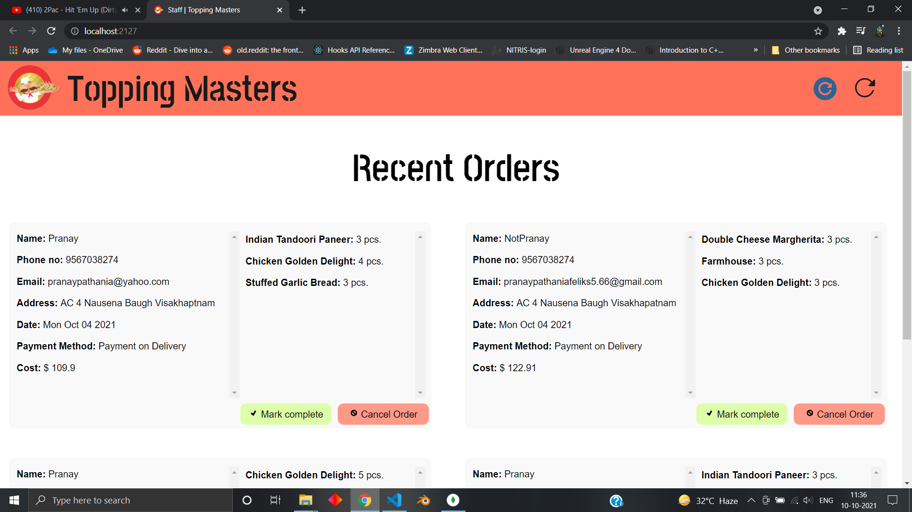

# Staff App

This is the app the staff of the imaginary company interacts with.
They use this app to either complete the order (when the food is delivered) or cancel it (for any apt reason).

The data reloads everytime an order is completed or cancelled.

---

### Reload buttons on the navbar

There are two types of reload buttons.

1. **Manual reload** : Reloads all data once
2. **Auto reload** : Reloads data every 30 seconds automatically. When on, the button changes to a shade of blue

---

### Screenshots

Main frontpage as seen by the staff if any orders are placed

Main frontpage as seen by the staff if no orders are placed or all orders have been completed or cancelled

Auto reload is on; notice the color of the auto reload button.

Note: In the screenshots, some orders may have floats as the final prices. That is because they are from a test data file which was used only for styling purpose and plays no role in the actual functioning of the app.
