# User App

This is the app the customer interacts with. It is the most complex app in this project. The user can:
1. Look at the homepage for 5 hours (because why not).
2. Login to shop for pizza
3. Fill up their cart and place order

---

### About the navbar
The navbar has three interactables
1. The logo, which is also a link to the homepage
2. The cart button, which links to te cart page (easier access than from the main-menu a.k.a the sidebar) 
3. The sidebar or menu-menu button, which open a sidebar with all the links, and a welcome message if you are logged in.

---

## Screenshots
Screenshots from the project

#### Homepage

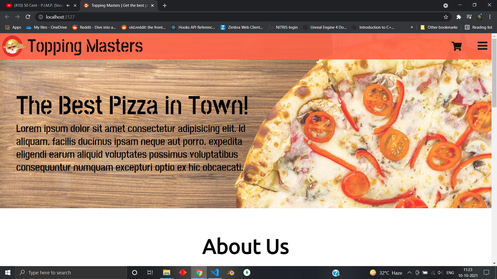 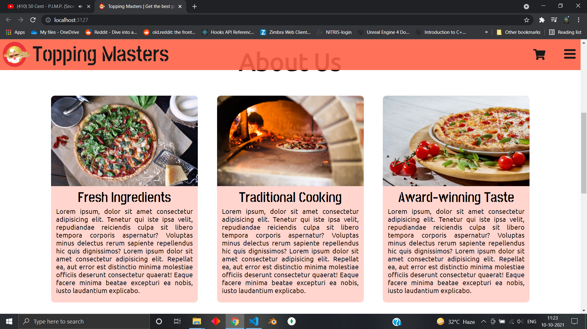
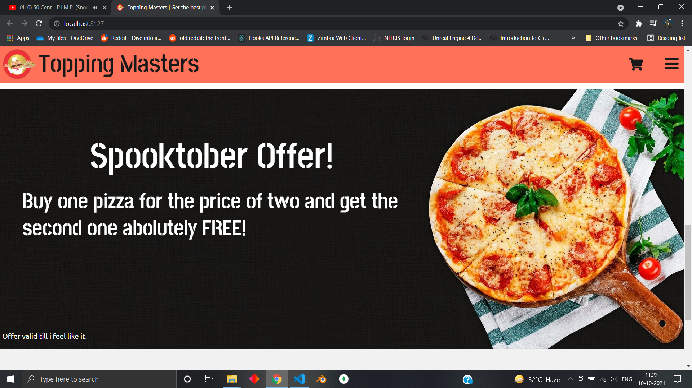 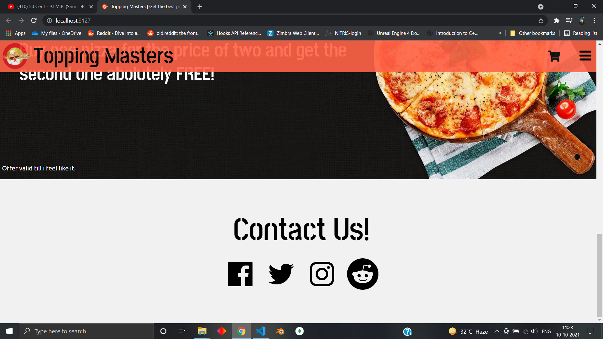
The home page in 4 pictures     

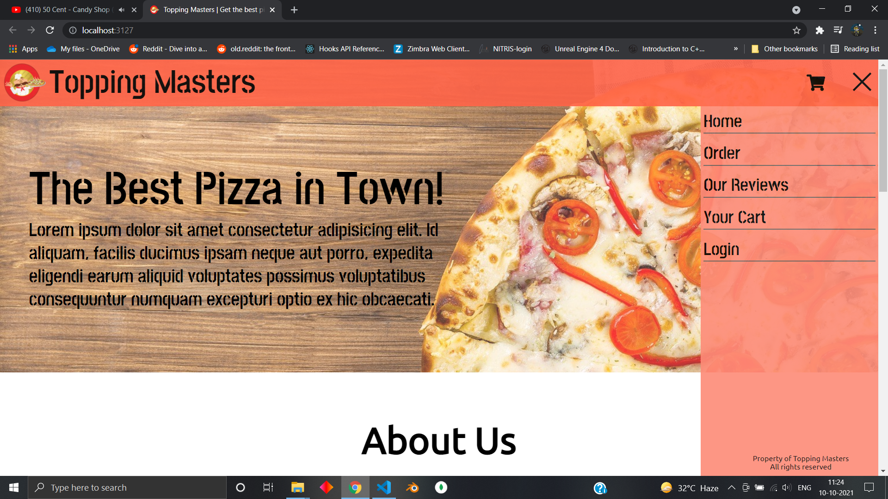
Sidebar     

Sidebar after login     

### Login/Logout

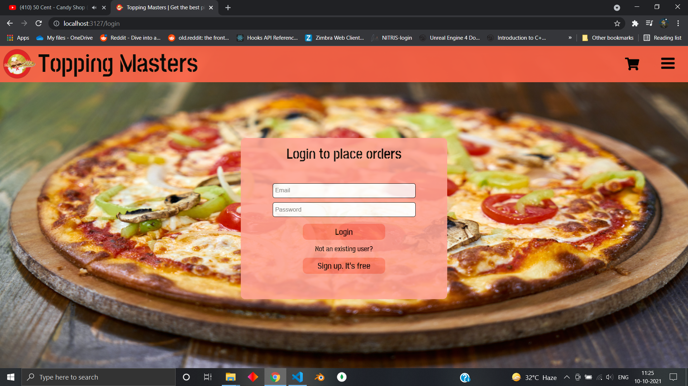
Login form     

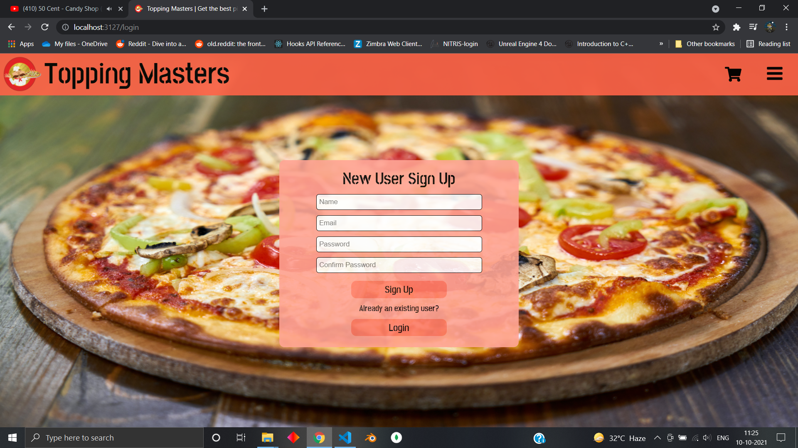
Signup form     

Modal Example     

Logout   

---

### Review

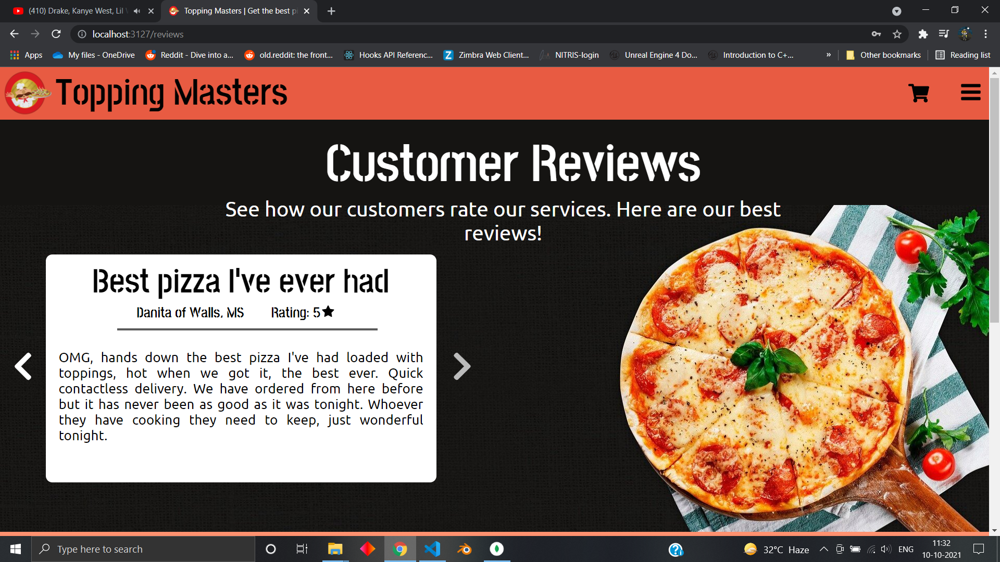
All reviews      

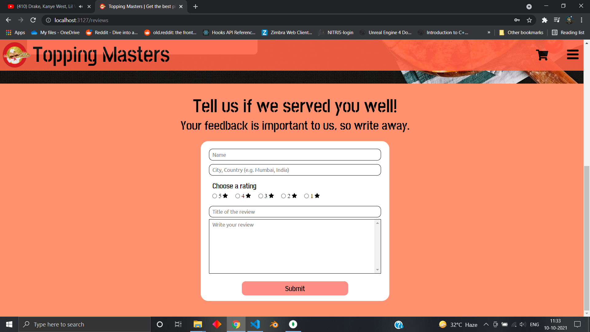
Review Form    

---

### Order Page

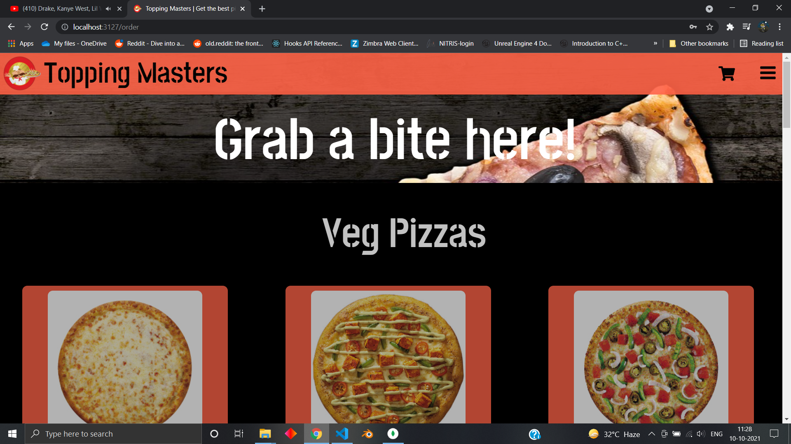 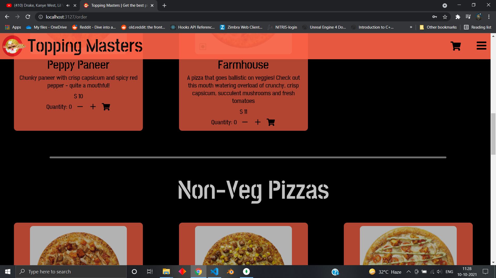
OrderPage      

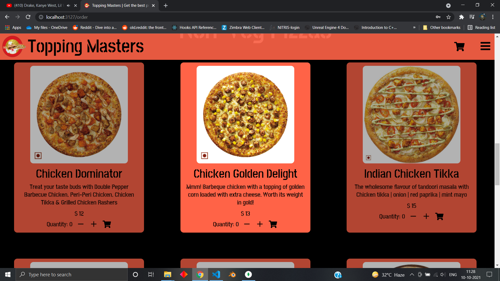
On hovering, the opacity of the card increases, bringing it to attention    

---

### Cart Page

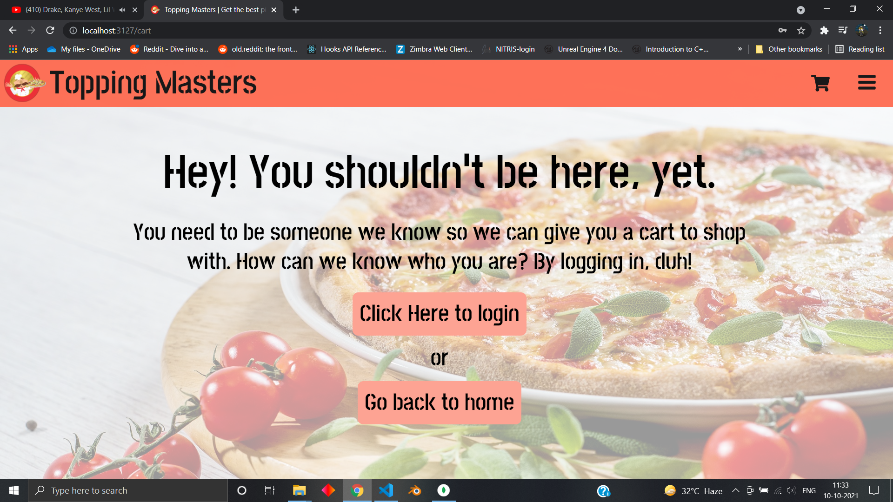
Cart Page if not logged in     

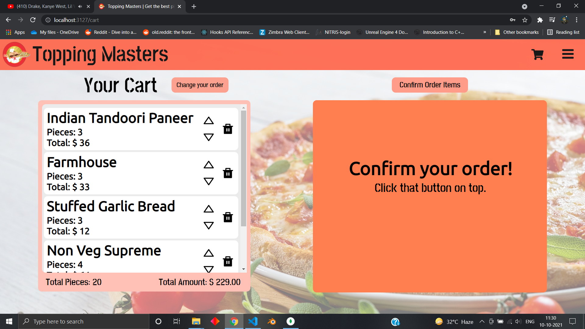
Cart Page if logged in. It shows a different text if cart is empty     

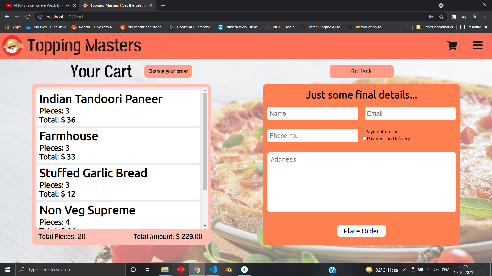
Cart Page after cart items have been finalised or confirmed. Changes cannot be made ON THIS PAGE anymore     

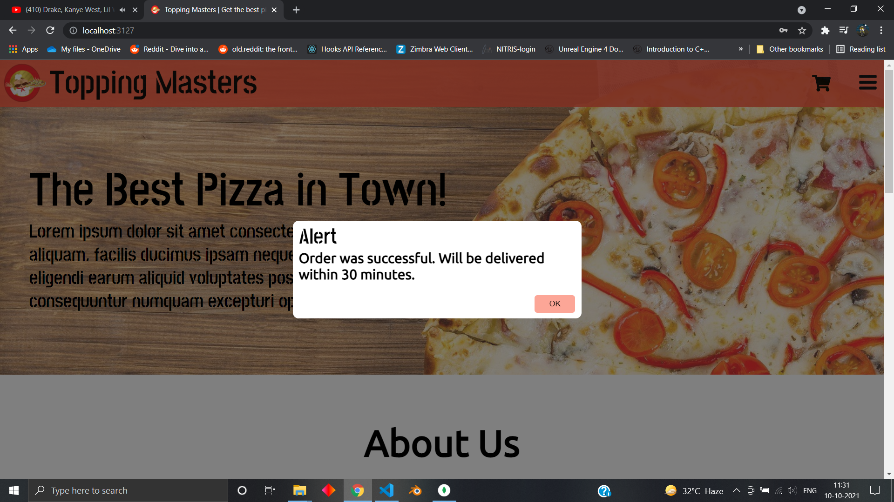
If order was placed successfully   

---
